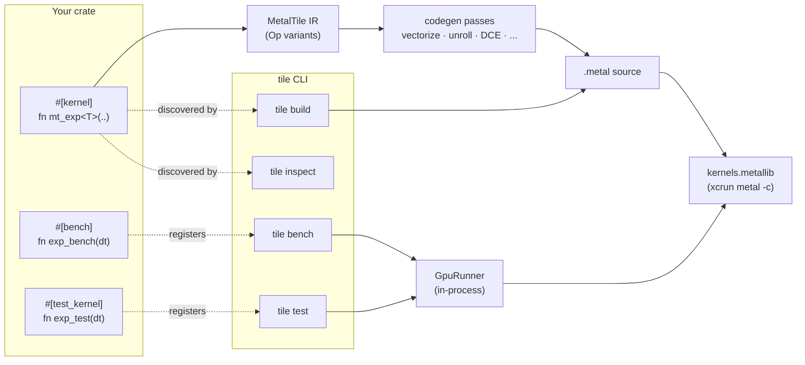

<div align="center">
  <h1>MetalTile</h1>

  [![Apple Silicon][platform-badge]][platform-url]
  [![Rust][rust-badge]][rust-url]
  [![License][license-badge]][license-url]

  [platform-badge]: https://img.shields.io/badge/platform-Apple%20Silicon-black?logo=apple&style=flat-square
  [platform-url]: https://developer.apple.com/metal/
  [rust-badge]: https://img.shields.io/badge/language-Rust-orange?logo=rust&style=flat-square
  [rust-url]: https://www.rust-lang.org/
  [license-badge]: https://img.shields.io/badge/license-Apache%202.0-green?style=flat-square
  [license-url]: LICENSE

  **[Docs](docs/)** | **[Baselines](baselines/)** | **[Contributing](CONTRIBUTING.md)**

</div>

---

A Rust-embedded DSL for writing Apple Metal GPU kernels. Write tile-level algorithms in Rust, get optimized Metal Shading Language out — verified against, and frequently faster than, hand-tuned MLX.

## Installation

```sh
curl -fsSL https://github.com/0xClandestine/metaltile/releases/latest/download/install.sh | sh
```

Run `tile update` at any time to upgrade to the latest release.

For contributors building from source, see [Getting Started](docs/getting-started.md).

## Getting Started

**1. Write a kernel.** Annotate a generic Rust function with `#[kernel(bench(...))]` — MetalTile generates `f32`, `f16`, and `bfloat16` Metal variants from a single definition and registers it against its MLX reference:

<table>
<tr>
<th>Rust DSL — what you write</th>
<th>Metal Shading Language — what you get</th>
</tr>
<tr>
<td>

```rust
#[kernel(
    bench(
        op    = "unary",
        subop = "exp",
        class = Unary,
        input = Signed,
        tol   = 1e-4,
        mlx   = "v_Exp{tn}{tn}",
        metal_file = "unary.metal",
    )
)]
pub fn mt_exp<T>(a: Tensor<T>, out: Tensor<T>) {
    let idx = program_id(0);
    store(out[idx], exp(load(a[idx])));
}
```

</td>
<td>

```cpp
kernel void mt_exp(
    const device float *a [[buffer(0)]],
    device float *out [[buffer(1)]],
    uint tid [[thread_position_in_grid]]
) {
    uint v_idx = tid;
    auto v1 = a[v_idx];
    auto v2 = exp(v1);
    out[v_idx] = v2;
}
```

</td>
</tr>
</table>

**2. Install the CLI and run.**

```sh
cargo install --path crates/metaltile-cli
tile bench --filter mlx/gemv
```

```
tile bench · Apple M1 Max
  mlx/gemv
  Shape                                │   MT(µs) │  Ref(GB/s) │  MT(GB/s) │   MT% │  GFLOP/s │  ok
  ────────────────────────────────────────────────────────────────────────────────────────────────────
  N=16M f32                           │    192.8 │      350.1 │     348.2 │   99% │    174.1 │   ✓
  N=16M f16                           │     62.1 │      583.6 │     540.1 │   93% │    540.1 │   ✓
  N=16M bf16                          │    136.8 │      615.2 │     245.2 │   40% │    245.2 │   ✓
```

The default table adds wall-clock latency (`MT(µs)`) and compute throughput
(`GFLOP/s`, blank for memory-bound kernels); `-v` adds the roofline (`%BW` /
`%FLOP` / arithmetic intensity), occupancy/registers, and a bottleneck verdict.

Read the [docs](docs/) to learn more.

## Architecture



`#[kernel]` lowers your DSL function to IR; the codegen passes optimise it; MSL emit produces a `.metal` source that `xcrun metal` compiles to a `metallib`. `#[bench]` / `#[test_kernel]` are optional annotations on the same function that register a setup callback the runner uses to dispatch the kernel and measure it (or diff against a CPU oracle).

> Today `tile bench` / `tile test` dispatch through the in-process `GpuRunner`; moving the runner into a dedicated subprocess (for isolation and parallelism) is planned.

## CLI reference

| Command | What it does |
|---|---|
| `tile build` | Compile every `#[kernel]` in the workspace to MSL and (optionally) a `metallib`. |
| `tile bench` | Run every `#[bench]`, report MetalTile GB/s vs the MLX reference + correctness. |
| `tile test` | Run every `#[test_kernel]` against its CPU oracle within tolerance. |
| `tile inspect` | Dump IR / per-pass IR / MSL for one kernel. |
| `tile device` | Print GPU device info and supported feature flags. |
| `tile snap` | Save bench results as a regression baseline. |
| `tile diff` | Compare bench results to a saved baseline. |
| `tile update` | Install the latest release (or build from a PR / commit). |

See [`docs/cli.md`](docs/cli.md) for the full flag surface.

## Contributing

Contributions are welcome. Read [`CONTRIBUTING.md`](CONTRIBUTING.md) for the issue / PR process and [`docs/developing.md`](docs/developing.md) for the kernel-authoring hazards **before** writing a kernel.

## Acknowledgements

MetalTile's benchmark suite and kernel library stand on the shoulders of the MLX ecosystem. A large
portion of the `metaltile-std` kernels are ports or faithful re-implementations of kernels from the following projects:

- [**ml-explore/mlx**](https://github.com/ml-explore/mlx) — primary source for reference kernels.
- [**ekryski/mlx**](https://github.com/ekryski/mlx) (`alpha`) — FFAI extensions: gated-delta, SSM replay, AURA codec.
- [**ml-explore/mlx-lm**](https://github.com/ml-explore/mlx-lm) — reference for GatedDeltaNet step semantics.

We are grateful to the MLX team at Apple and the broader MLX community, this wouldn't have been possible without you.

See [`ACKNOWLEDGEMENTS.md`](ACKNOWLEDGEMENTS.md) for the full list of individual contributors and third-party software.

## License

<sup>
Licensed under the <a href="LICENSE">Apache License, Version 2.0</a>.
</sup>
