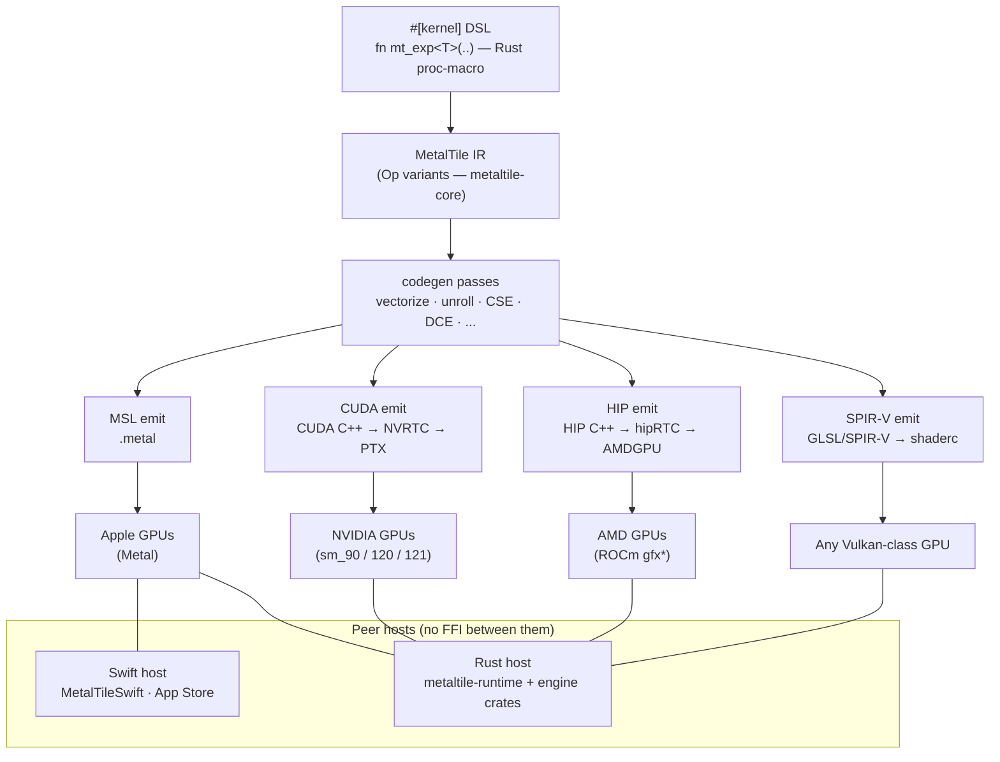

# MetalTile

A Rust-embedded DSL for writing GPU kernels once and running them everywhere. Write tile-level algorithms in Rust with `#[kernel]`, and the same kernel source lowers to **four GPU backends** — Apple Metal (MSL), NVIDIA (CUDA), AMD (HIP/ROCm), and any Vulkan-class GPU (SPIR-V).

metaltile is the kernel layer beneath an LLM inference engine that runs a 30B-parameter hybrid model (Mamba2 SSM + 128-expert MoE + GQA attention) resident-decode on a single Grace-Blackwell (GB10) box; the same kernels also run on Apple GPUs — no per-backend rewrite.

```rust
#[kernel]
pub fn mt_rms_norm<T>(
    x: Tensor<T>,
    w: Tensor<T>,
    out: Tensor<T>,
    eps_buf: Tensor<f32>,
    #[constexpr] n: u32,
) {
    let row = program_id::<0>();
    let rs = row * n;
    let re = rs + n;
    let ssq = strided_reduce_dot(x, x, rs, 0, re);
    let tg_ssq = reduce_sum(ssq);
    let eps = load(eps_buf[0]);
    let rms = rsqrt(tg_ssq / n + eps);
    let n_full = n / (lsize * 4u32);
    for _r in range(0u32, n_full, 1u32) {
        let base = rs + (_r * lsize + tid) * 4u32;
        let col = base - rs;
        let n0 = load(x[base]).cast::<f32>() * rms * load(w[col]).cast::<f32>();
        let n1 = load(x[base + 1u32]).cast::<f32>() * rms * load(w[col + 1u32]).cast::<f32>();
        let n2 = load(x[base + 2u32]).cast::<f32>() * rms * load(w[col + 2u32]).cast::<f32>();
        let n3 = load(x[base + 3u32]).cast::<f32>() * rms * load(w[col + 3u32]).cast::<f32>();
        store(out[base], n0.cast::<T>());
        store(out[base + 1u32], n1.cast::<T>());
        store(out[base + 2u32], n2.cast::<T>());
        store(out[base + 3u32], n3.cast::<T>());
    }
    for _i in range(rs + n_full * lsize * 4u32 + tid, re, lsize) {
        let ni = load(x[_i]).cast::<f32>() * rms * load(w[_i - rs]).cast::<f32>();
        store(out[_i], ni.cast::<T>());
    }
}
```

This generates ~104% of MLX's hand-tuned `rms` kernel throughput on M4 Max across f32/f16/bfloat16.

## Why MetalTile

- **Write once in Rust, run on Apple, NVIDIA, AMD, and Vulkan-class GPUs.** No raw MSL/CUDA/HIP, no thread-position arithmetic — one kernel source, four backends.
- **Tile-level, not thread-level.** `strided_reduce`, `reduce_sum`, `dot` — express what to compute, the compiler handles thread mapping, vectorization, and SIMD-group reductions.
- **Verified against MLX.** Every kernel is benchmarked and numerically compared against the corresponding MLX Metal kernel. 139/139 ops correct, avg 110% of MLX throughput on M4 Max.
- **All three float dtypes.** `f32`, `f16`, and `bfloat16` work identically — native `bfloat` emitted on Metal 3.1+.
- **CPU interpreter included.** Every kernel runs on the CPU reference interpreter (`metaltile-interp`) for CI without a Mac.

## Status

Early development — APIs are not yet stable. Core DSL works; autotuner and type-level shape algebra are planned for v0.2.

| Crate | Description | Status |
|---|---|---|
| `metaltile-core` | IR types, DType, Shape | Complete |
| `metaltile-macros` | `#[kernel]` proc macro | Working |
| `metaltile-codegen` | MSL lowering + 6 opt passes | Working |
| `metaltile-interp` | CPU reference interpreter | Working |
| `metaltile-runtime` | Metal dispatch, PSO cache | Working |
| `metaltile` | Facade re-exporting all crates | — |

## Quick Start

```toml
[dependencies]
metaltile = "0.1"
```

```rust
use metaltile::prelude::*;

#[kernel]
fn vector_add(a: Tensor<f32>, b: Tensor<f32>, c: Tensor<f32>) {
    let idx = program_id::<0>();
    store(c[idx], load(a[idx]) + load(b[idx]));
}

fn main() -> Result<(), Box<dyn std::error::Error>> {
    let ctx = Context::new()?;
    let n = 256usize;
    let a: Vec<u8> = (0..n).flat_map(|i| (i as f32).to_le_bytes()).collect();
    let b: Vec<u8> = (0..n).flat_map(|_| (1.0f32).to_le_bytes()).collect();
    let c = vec![0u8; n * 4];

    let result = vector_add::launch(&ctx)
        .input("a", a)
        .input("b", b)
        .input("c", c)
        .dispatch()?;

    let out: Vec<f32> = result.outputs["c"]
        .chunks_exact(4)
        .map(|b| f32::from_le_bytes(b.try_into().unwrap()))
        .collect();
    println!("out[0] = {}", out[0]); // 1.0
    Ok(())
}
```

To inspect the generated MSL directly:

```rust
use metaltile::codegen::MslGenerator;

let msl = MslGenerator::default().generate(&vector_add::kernel_ir())?;
println!("{msl}");
```

## Supported Operations

27 operation categories benchmarked against MLX:

**Elementwise**: unary (exp, log, sqrt, sin, cos, erf, sigmoid, silu, gelu, relu, …), binary (add, mul, sub, div, max, min, pow, logaddexp), ternary (select), copy, arange

**Reductions**: all-reduce sum/max/min, row-reduce sum/max/min, logsumexp, softmax, rms-norm, layer-norm

**Matrix**: GEMV, masked GEMV, matmul (fp16 steel/gemm), SDPA vector decode

**Misc**: RoPE, scan (parallel prefix sum), arg-reduce (argmax), sort (bitonic), random (xorshift32), quantized GeMV (int4), fp4 quantize/dequantize, strided copy (non-contiguous tensors)

## Benchmarks

Run against MLX Metal kernels on M4 Max:

```
cargo run --release -p metaltile-bench --bin bench_suite
```

Selected results (M4 Max, higher = better vs MLX):

| Op | MT% of MLX |
|---|---|
| softmax f32 | ~105% |
| rms_norm f16 | ~104% |
| all_reduce f32 | ~100% |
| gemv f16 | ~100% |
| argmax f32 | **206%** |
| scan f32 | ~104% |

Full benchmark table with correctness checks:

```
cargo run --release -p metaltile-bench --bin bench_suite -- --filter softmax
```

## Architecture

One `#[kernel]` DSL, four GPU backends. Your kernel lowers to a shared IR; the codegen passes optimise it once; then each backend emitter turns that IR into the target's native shader source. Two **peer hosts** consume the same kernels with no FFI between them — a Swift host (`MetalTileSwift`, Metal/Apple, ships to the App Store) and the Rust host (`metaltile-runtime` + downstream engine crates).



### Backends

| Backend | Target GPU | Compile path | Status |
|---|---|---|---|
| **MSL** | Apple (Metal) | `.metal` → `metallib` (`xcrun metal`) | Stable — default, zero-config on macOS |
| **CUDA** | NVIDIA (sm_90 / 120 / 121, e.g. GB10) | CUDA C++ → NVRTC → PTX, runtime compile | Stable — `--features cuda` |
| **HIP** | AMD (ROCm, `gfx*`) | HIP C++ → hipRTC → AMDGPU code object | Complete · validation in progress — `--features hip` |
| **Vulkan** | Any Vulkan-class GPU | SPIR-V via shaderc → Vulkan compute | Complete · validation in progress — `--features vulkan` |

The non-Metal backends are opt-in Cargo features so the macOS Metal path stays zero-config and dependency-light; each needs its toolchain/driver at link/run time (CUDA toolkit, ROCm, or the Vulkan SDK). HIP and Vulkan have the full kernel set implemented (codegen-complete); end-to-end model validation is in progress — they are not yet verified against a full model run. The CUDA runtime additionally provides NVRTC runtime compile, a capturable non-blocking stream, CUDA-graph capture hooks (`begin_capture` / `end_capture` / `graph_launch`), a buffer pool, pinned async host-to-device copies, and an optional `--fmad` codegen gate (`MT_FMAD=1`). See `specs/{CUDA,AMD,VULKAN}_BACKEND_SPEC.md`.

Optimization passes: TypeCheck → ConstFold → TileLowering → Fusion → Schedule → Vectorize.

## License

Licensed under the [Apache License, Version 2.0](LICENSE).
