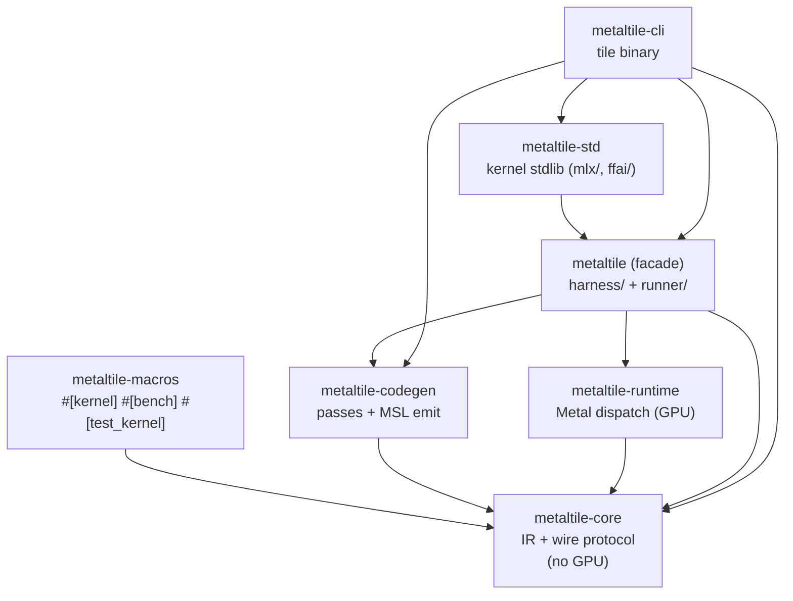
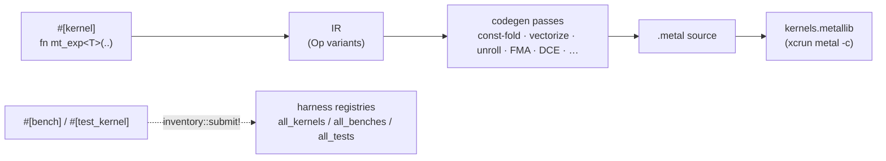
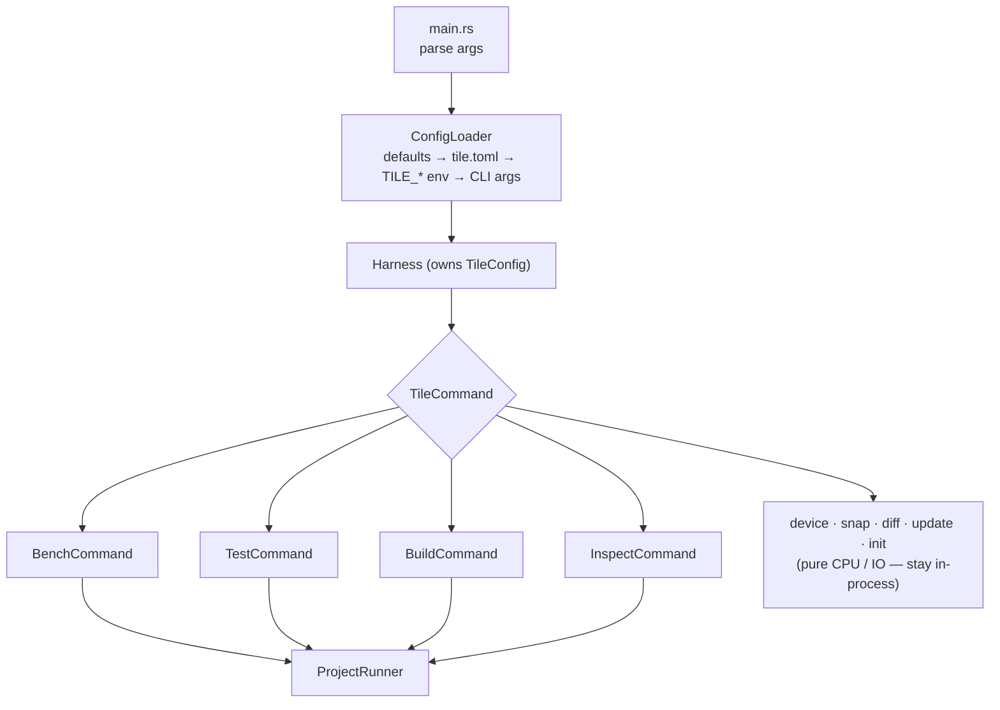
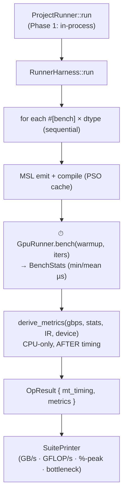
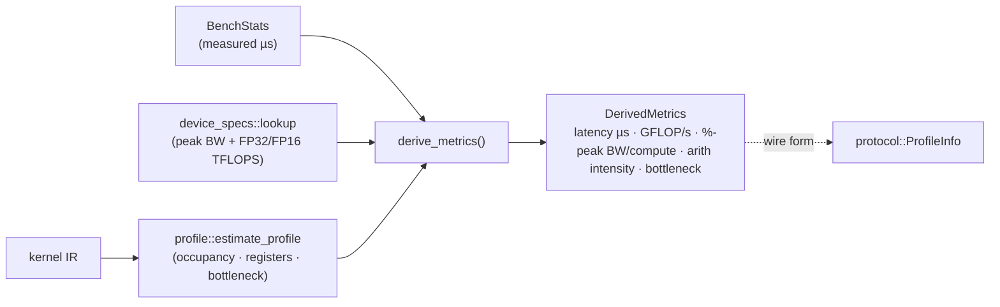
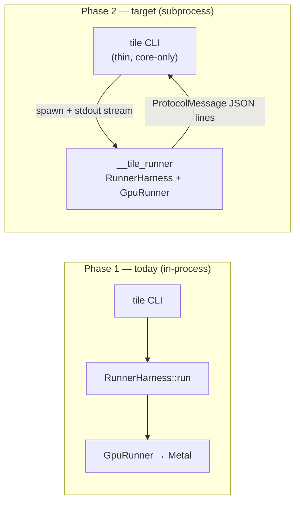

<!--
Copyright 2026 0xClandestine, Ekryski, TheTom, Ambisphaeric
SPDX-License-Identifier: Apache-2.0
-->
# MetalTile Architecture

How a `#[kernel]` becomes a compiled Metal shader, and how `tile bench` /
`tile test` run and measure it today. Companion docs:
[`TOOLCHAIN_DESIGN.md`](TOOLCHAIN_DESIGN.md) (the `#[kernel]`/`#[bench]`/
`#[test_kernel]` macro surface), [`BENCH_METRICS_SPEC.md`](BENCH_METRICS_SPEC.md)
(metric definitions), [`cli.md`](cli.md) (command flags),
[`developing.md`](developing.md) (kernel-authoring hazards).

> **Status:** the runner executes **in-process** today (Phase 1). The wire
> protocol, arg parsing, and JSON-line emission for a future `__tile_runner`
> **subprocess** (Phase 2) are scaffolded but not yet on a process boundary —
> see [Subprocess readiness](#subprocess-readiness).

## Crates

| Crate | Responsibility |
|---|---|
| `metaltile-core` | IR (`Op`, `Kernel`) + the `protocol` wire types (`ProtocolMessage`, `ProfileInfo`). Pure — no GPU, no tooling deps. |
| `metaltile-macros` | `#[kernel]` (lowers a DSL fn to IR), `#[bench]` / `#[test_kernel]` (register a setup callback via `inventory`). |
| `metaltile-codegen` | Optimization passes (vectorize, unroll, fusion, DCE, …) + MSL emission. |
| `metaltile-runtime` | Metal device, buffers, PSO cache, dispatch + timing. |
| `metaltile` (facade) | Re-exports the above; hosts `harness/` (the kernel/bench/test **registries**) and `runner/` (the in-process **GPU execution** engine). |
| `metaltile-std` | The kernel standard library (`mlx/`, `ffai/`) — every `#[kernel]`/`#[bench]`/`#[test_kernel]` lives here. Depends on the facade. |
| `metaltile-cli` | The `tile` binary: config, command dispatch, result rendering. |

> **Dependency note (Phase 1 vs Phase 2):** the CLI currently depends on the
> `metaltile` facade (and `-codegen`/`-std`) because it runs the GPU work
> in-process, so it still links the Metal stack transitively. The Phase-2
> target is `metaltile-cli → metaltile-core` only (wire types), with all GPU
> work behind the subprocess.

## From source to shader

`#[kernel]` lowers the DSL function to IR; the codegen passes optimise it; MSL
emission produces a `.metal` source that `xcrun metal` compiles to a
`metallib`. `#[bench]` and `#[test_kernel]` are optional annotations on the same
function that register a **setup callback** (`BenchSetup` / `TestSetup`) into an
`inventory` registry the runner iterates.

## Command dispatch

Every subcommand is a struct implementing the `TileCommand` trait
(`cmd/mod.rs`); `main.rs` parses args, builds a `Harness` (the loaded
`TileConfig`), and dispatches:

`bench` / `test` / `build` / `inspect` route through **`ProjectRunner`**, the
seam where Phase 2 will spawn the subprocess. `device` (Metal query), `snap`
(save baseline), `diff` (compare baselines), `update` (self-update), and `init`
(scaffold a new project) are pure CPU / IO and run directly.

## Bench runner

The bench run loop is **sequential** — GPU dispatch + timing is serialized on
the device, so running benches concurrently would corrupt timings. (The CPU-only
work that *can* parallelize — `tile build` MSL emit, `tile test` oracles — uses
`rayon`; the bench run does not.)

**Timing isolation.** `GpuRunner.bench(…)` is the *only* timed region; it
returns the finalized `BenchStats`. `derive_metrics` runs strictly afterward and
*consumes* those stats — it never dispatches to the GPU. So metric computation
**cannot skew** the measured kernel performance.

## Test runner

`tile test` iterates the `#[test_kernel]` registry and dispatches each setup
in-process, comparing GPU output against the test's CPU oracle within its
tolerance. The CPU oracle pass is `rayon`-parallel (`par_iter`, order-preserving
via `collect`); GPU dispatch of the survivors is sequential.

## Kernel profiling

The roofline / occupancy metrics shown under `tile bench -v` / `-vv`:

- `profile::estimate_profile` runs the pass pipeline + register/occupancy
  analysis on the IR (pure CPU).
- `device_specs::lookup` returns per-chip peak ceilings (bandwidth + FP32
  TFLOPS, with FP16 = 2× FP32 on the SIMD pipe, and the M5 Neural-Accelerator
  FP16 ceiling where applicable). Unknown devices return `None` → roofline
  columns blank, never an error.
- `DerivedMetrics` is the in-process struct; `protocol::ProfileInfo` is its
  serializable wire form for the Phase-2 subprocess path.

See [`BENCH_METRICS_SPEC.md`](BENCH_METRICS_SPEC.md) for the metric formulas and
device-spec sourcing.

## Subprocess readiness

The runner is **not** a subprocess yet. `ProjectRunner::run` delegates
in-process to `metaltile::runner::RunnerHarness::run`. The Phase-2 scaffolding
is in place:

| Piece | Where | Purpose |
|---|---|---|
| `ProtocolMessage` (+ `runner_version`) | `metaltile-core::protocol` | Versioned JSON-line wire format (CLI ↔ runner). |
| `RunnerArgs` | `metaltile::runner::args` | Subprocess CLI arg parsing (`from_env_args`). |
| `emit` | `metaltile::runner::emit` | Emit `ProtocolMessage` JSON lines to stdout. |
| `RunnerHarness` | `metaltile::runner::harness` | Runs bench/test/build/inspect, emitting protocol messages. |
| `ProjectRunner` | `metaltile-cli::project_runner` | The spawn seam — today calls `RunnerHarness::run` directly; Phase 2 flips it to spawn `__tile_runner` and stream stdout. |

When Phase 2 lands, the `tile` binary becomes a thin protocol parser with no GPU
dependency; the generated `__tile_runner` (linked against the user's project)
owns all kernel/GPU work and streams results back as `ProtocolMessage` lines.
